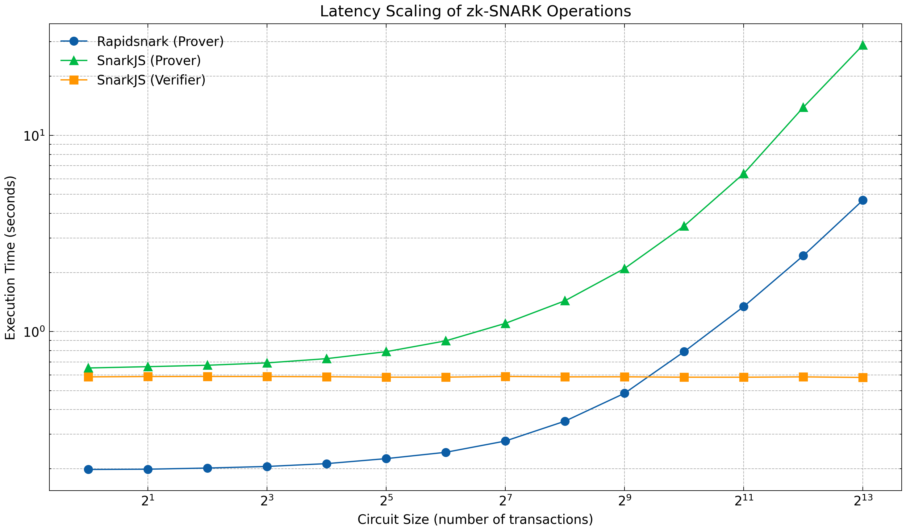
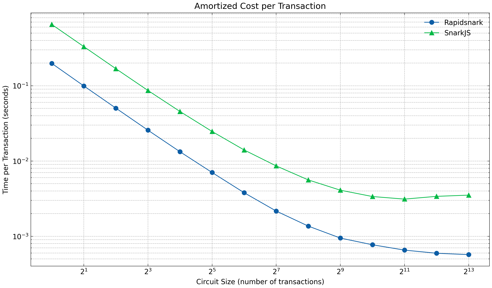
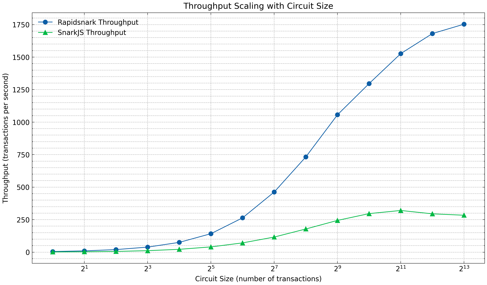
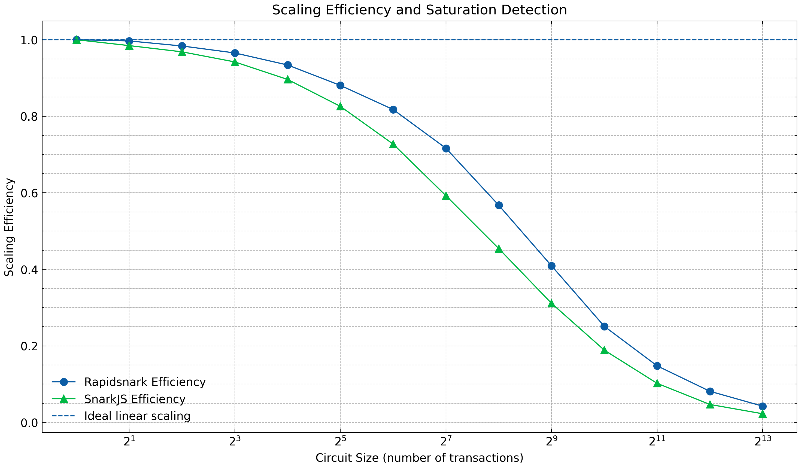

# A Zero-Knowledge Rollup for Monetary Transactions

> Reference implementation accompanying a CIFRE doctoral thesis (2024–2027) on
> the use of succinct cryptographic proofs to scale on-chain monetary
> settlement systems. The artefact instantiates a Groth16-based zk-rollup
> targeting Ethereum, with EIP-4844 blobs as the data-availability layer.

---

## 1. Abstract

This repository contains an end-to-end implementation of a *validity rollup*
in which a sequence of off-chain monetary transactions is compressed into a
single zk-SNARK proof, posted to a Layer-1 verifier contract together with a
reference to the underlying transaction data published as an EIP-4844 blob.
The rollup is parameterised by the batch cardinality *N* (a power of two), and
a separate arithmetic circuit and trusted-setup ceremony are produced for each
*N ∈ {1, 2, 4, 8, 16, 32, 64, …, 8192}*. The artefact is intended as a
controlled testbed for measuring (i) the proof-generation cost as a function of
batch size, (ii) the on-chain verification cost on the Ethereum Sepolia
testnet, and (iii) the data-availability cost of EIP-4844 blob transactions,
under realistic load conditions reaching 8192 transactions per batch.

The implementation favours methodological transparency over engineering
sophistication: each component (sequencer, executor, prover, data-availability
publisher, L1 settlement client) is deliberately small and self-contained, so
that each measurement can be attributed to a well-identified subsystem.

---

## 2. System model

The system follows the classical four-actor decomposition of a validity
rollup. Let `S_t ∈ Σ` denote the rollup state at logical time *t* (a mapping
from accounts to balances), and let *T_t* denote a finite ordered set of user
transactions submitted between *t* and *t+1*.

```
        ┌────────────┐  POST /add_transaction   ┌─────────────────┐
   user ─▶│ Sequencer  │ ───────────────────────▶│ persistent pool │
        └────────────┘                          │   (SQLite/WAL)  │
                                                 └─────────────────┘
                                                         │
                                       get_batch (N max) ▼
                                                 ┌─────────────────┐
                                                 │  Batch  (size N)│
                                                 └─────────────────┘
                                                         │
                                                         ▼
                                                 ┌─────────────────┐
   off-chain                                     │   Executor      │ S_t  → S_{t+1}
                                                 └─────────────────┘
                                                         │
                                                         ▼
                                                 ┌─────────────────┐
                                                 │   Prover (GR16) │ π,  σ_pub
                                                 └─────────────────┘
                                                         │
                                          build blob,    ▼
                                          KZG commit  ┌──────────────────┐
                                          versioned   │ DataAvailability │
                                          hash h_v    │ (local + EIP-4844)│
                                                       └──────────────────┘
                                                         │
                                                         ▼
   on-chain (Sepolia)                            ┌────────────────────────┐
                                                 │  Rollup.submitBatch    │
                                                 │  blobhash(0) == h_v    │
                                                 │  Verifier_N(π, σ_pub)  │
                                                 │  S_root ← S_root_after │
                                                 └────────────────────────┘
```

State transitions are settled on Ethereum via a single type-3 (EIP-4844)
transaction that simultaneously (i) carries the encoded transaction set as a
single 128 kiB blob and (ii) calls the rollup verifier contract. This binding
ensures that the data-availability commitment and the validity proof refer to
the same logical batch, since the contract enforces
`blobhash(0) = blobVersionedHash` inside the verification function.

---

## 3. Cryptographic constructions

### 3.1 Arithmetic circuits

The transition function for a batch of *N* transfers is encoded as a Circom
circuit
*C_N : F_r^{m(N)} → F_r* over the BN254 scalar field. For each transaction *i*,
the circuit verifies:

* `srcBalance[i] - amount[i] = srcBalanceAfter[i]`
* `destBalance[i] + amount[i] = destBalanceAfter[i]`
* non-negativity of `srcBalanceAfter[i]`,

and outputs a single public signal *σ_pub ∈ {0,1}* certifying the conjunction
of the *N* transition constraints. The artefact ships the witnesses, R1CS
descriptions, and proving/verification keys for *N ∈ {1, 2, 4, 8, 16, 32, 64}*.
Larger sizes can be regenerated via `scripts/bench/generate_environments.py`, which
performs the full Powers-of-Tau and Phase-2 ceremonies and emits the Solidity
verifier through `snarkjs zkey export solidityverifier`.

### 3.2 Proof system

Proofs are produced using **Groth16** in two interchangeable backends:

* `snarkjs` (pure JavaScript) — used as the reference for correctness;
* `rapidsnark` (C++ via Docker) — used for performance benchmarking.

The mode is selected at construction time (`Prover(state, mode="snarkjs"|"rapidsnark")`).
For each batch the prover materialises an `input.json`, runs witness generation
and proof generation, and stores `proof.json`, `public.json`, and a copy of
`proof.json` archived under `proofs/` for *post hoc* audit.

### 3.3 Data availability

A batch is encoded as a length-prefixed binary record (4 B `batch_id`,
4 B `tx_count`, then per-transaction `(length, JSON)` pairs), zlib-compressed,
and packed into a single 4096-element BLS12-381 field-element blob using the
standard 31-byte-per-element encoding (one zero byte prefix per slot to ensure
the canonical inequality `value < r`). The KZG commitment, opening proof, and
versioned hash are computed via the reference `c-kzg-4844` library
(`pip install ckzg`). The blob, calldata, and versioned hash are then
co-located in a single EIP-4844 type-3 transaction.

---

## 4. Settlement layer

### 4.1 Verifier contracts

For each batch size *N*, the snarkjs-generated `Groth16Verifier` is deployed
to Sepolia. All circuits in the present artefact expose a single public
signal, hence the verifier ABI uniformly exhibits the signature
`verifyProof(uint[2], uint[2][2], uint[2], uint[1])`.

### 4.2 Rollup contract

The orchestrating contract (`smart_contract/Rollup.sol`, Solidity 0.8.24,
target EVM Cancun) maintains:

* `bytes32 stateRoot` — the canonical commitment to the L2 account balances,
  initialised at deployment to `SHA-256( JSON(initial_balances) )`;
* `mapping(uint256 ⇒ address) verifiers` — a registry from batch size to
  Groth16 verifier address;
* `uint256 batchCount` — a monotonic batch counter.

The settlement entry point is

```solidity
function submitBatch(
    uint256 batchSize,
    uint[2]   calldata a,
    uint[2][2] calldata b,
    uint[2]   calldata c,
    uint[1]   calldata input,
    bytes32   stateRootBefore,
    bytes32   stateRootAfter,
    bytes32   blobVersionedHash
) external;
```

which (i) asserts liveness against replay via `stateRootBefore == stateRoot`,
(ii) asserts data availability via `blobhash(0) == blobVersionedHash`,
(iii) delegates verification to `verifiers[batchSize]`, (iv) updates the state
root, and (v) emits `BatchSubmitted` for off-chain indexing.

This contract is intentionally minimal: it implements neither deposits nor
withdrawals, and it does not enforce any policy on the *contents* of the blob.
The single state-transition predicate is the validity of the SNARK with
respect to the public signals; the blob commitment ensures that the input to
that predicate is publicly retrievable.

### 4.3 Deployed instances (Sepolia)

The artefact has been deployed to the Ethereum **Sepolia** testnet
(chain id 11155111). The addresses below correspond to the verifier and
rollup contracts referenced by the running system and can be inspected
directly on Etherscan.

| Component        | Batch size *N* | Address                                                                                                                          |
| ---------------- | -------------- | -------------------------------------------------------------------------------------------------------------------------------- |
| Rollup           | —              | [`0x795B914CE8fCd84B81e93F740a12F90B7941Ba84`](https://sepolia.etherscan.io/address/0x795B914CE8fCd84B81e93F740a12F90B7941Ba84) |
| Groth16Verifier  | 1              | [`0xb33b27Ca3c02923858e9a32Af4A00c9F41F03F54`](https://sepolia.etherscan.io/address/0xb33b27Ca3c02923858e9a32Af4A00c9F41F03F54) |
| Groth16Verifier  | 2              | [`0xBeeBAA7266c0Ba5534Bb249767E1EC8E77b16526`](https://sepolia.etherscan.io/address/0xBeeBAA7266c0Ba5534Bb249767E1EC8E77b16526) |
| Groth16Verifier  | 4              | [`0xA46FF549F61D29C8553dB863DdB73D5659Da5FCD`](https://sepolia.etherscan.io/address/0xA46FF549F61D29C8553dB863DdB73D5659Da5FCD) |
| Groth16Verifier  | 8              | [`0x9483FE50F3759Ae4f52050fAde2C1d22114A3DA7`](https://sepolia.etherscan.io/address/0x9483FE50F3759Ae4f52050fAde2C1d22114A3DA7) |
| Groth16Verifier  | 16             | [`0x5B3df957a4d6a802F460136292c6C3C75f2d49BD`](https://sepolia.etherscan.io/address/0x5B3df957a4d6a802F460136292c6C3C75f2d49BD) |
| Groth16Verifier  | 32             | [`0x4fa879Dd6220d43EDF80de874eFd0F44138A1AAf`](https://sepolia.etherscan.io/address/0x4fa879Dd6220d43EDF80de874eFd0F44138A1AAf) |
| Groth16Verifier  | 64             | [`0x6411AaDC22fda639905c2e252AD12c620bCc5e58`](https://sepolia.etherscan.io/address/0x6411AaDC22fda639905c2e252AD12c620bCc5e58) |

Submitted batches and their EIP-4844 blobs can additionally be inspected on
[Blobscan](https://sepolia.blobscan.com/) by filtering on the `from` field
of the rollup deployer or by following the `BatchSubmitted` event log of the
rollup contract above. Verifier addresses for the larger batch sizes
(*N ∈ {128, 256, …, 8192}*) are not pinned in this artefact and are
regenerated locally on demand via `scripts/chain/deploy_contracts.py`.

---

## 5. Repository layout

```
zk_rollup/
├── classes/
│   ├── ZKRollup.py            orchestrator (batching loop, snapshot, recovery)
│   ├── Sequencer.py           FastAPI ingestion + power-of-two batch selection
│   ├── TxPool.py              SQLite/WAL persistent transaction pool
│   ├── Executor.py            state transition function (off-chain replay)
│   ├── Prover.py              Groth16 driver + on-chain submission
│   ├── DataAvailability.py    JSON archives + binary blob payload
│   └── L1Client.py            EIP-4844 type-3 transaction builder
├── models/                    Transaction, Batch, State, request DTOs
├── circuits/<N>/              Per-size Circom artefacts (r1cs, zkey, vk, …)
├── smart_contract/
│   ├── Rollup.sol             settlement contract (Cancun)
│   └── abi/Rollup.json        ABI emitted by the deployment script
├── scripts/
│   ├── chain/                 on-chain interaction
│   │   ├── deploy_contracts.py        automated deployment to Sepolia
│   │   ├── inspect_rollup.py          on-chain state / event tail
│   │   └── send_transaction.py        asynchronous load generator
│   ├── bench/                 measurement harnesses
│   │   ├── measure_zk_resources.py    CPU / RAM / I-O per Groth16 phase
│   │   ├── measure_batch_cost.py      empirical G_batch on Sepolia
│   │   ├── measure_settlement_latency.py  end-to-end settlement latency
│   │   ├── generate_proofs.py         snarkjs / rapidsnark proving bench
│   │   ├── generate_environments.py   per-size circuit ceremony driver
│   │   └── rapidsnark/                Docker image + helper scripts
│   ├── collect/               on-chain / market data collection
│   ├── analysis/              figures and LaTeX tables from raw results
│   └── circuit_template/      circuit.circom + vendored circomlib
├── batch/                     DA archives (one JSON per committed batch)
├── blob/                      compressed blob payloads (debug / fallback)
├── proofs/                    archived proofs per batch
├── storage/                   txpool.db (SQLite) + last_committed.json
├── bench-out/                 raw measurements and generated figures
├── main.py                    runtime entry point
└── requirements.txt
```

---

## 6. Reproducibility

### 6.1 Software prerequisites

* Python ≥ 3.11 (tested with 3.14)
* Node.js ≥ 18 with `snarkjs ≥ 0.7`, `circom ≥ 2.1`
* solc 0.8.24 (auto-installed by `py-solc-x`)
* `c-kzg-4844` Ethereum trusted setup (≈ 410 kB, public)
* Optional: Docker, with the `rapidsnark` image, for the C++ prover backend

Python dependencies are pinned in `requirements.txt`:

```
pip install -r requirements.txt
```

### 6.2 Environment configuration

The runtime expects the following entries in `.env`:

| Key                   | Description                                                 |
| --------------------- | ----------------------------------------------------------- |
| `INITIAL_BALANCE`     | Per-account initial balance used to seed `S_0`.             |
| `NB_INITIAL_WALLET`   | Number of accounts in `S_0`.                                |
| `EPOCH`               | Number of batches per DA epoch (controls archival rotation).|
| `WS_ADDRESS`          | Sepolia JSON-RPC endpoint (HTTPS or WSS).                   |
| `WALLET_ADDRESS`      | Deployer / sequencer L1 address.                            |
| `WALLET_PRIVATE_KEY`  | Private key controlling `WALLET_ADDRESS`.                   |
| `TRUSTED_SETUP_PATH`  | Path to the c-kzg-4844 trusted setup (`trusted_setup.txt`). |
| `CIRCUIT_<N>_ADDRESS` | Verifier contract address for batch size *N*.               |
| `ROLLUP_ADDRESS`      | Rollup contract address (settlement entry point).           |

The trusted setup may be obtained from:

```
https://raw.githubusercontent.com/ethereum/c-kzg-4844/main/src/trusted_setup.txt
```

### 6.3 Deployment

A single command compiles every `circuits/<N>/verifier.sol` with solc 0.8.24
under EVM target Cancun, deploys each verifier to Sepolia, deploys the
`Rollup` contract with `S_root_0 = SHA-256(JSON(S_0))`, registers each verifier
through `setVerifier(N, addr)`, and writes all addresses back into `.env`:

```
python scripts/chain/deploy_contracts.py
```

Verifiers already known in `.env` can be skipped with `--skip-existing`,
which is convenient for redeploying solely the Rollup after an experimental
restart.

### 6.4 Operation

```
python main.py                       # launches the rollup loop
python scripts/chain/send_transaction.py   # asynchronous load generator
python scripts/chain/inspect_rollup.py     # on-chain state and event tail
```

Recovery semantics: at boot, `ZKRollup` reloads its state from
`storage/last_committed.json` (written atomically after each successful
on-chain commit). If the snapshot is absent, the latest `batch/batch_*.json`
acts as a fallback. Once initialised, the runtime reads `Rollup.stateRoot()`
on Sepolia and emits a divergence warning if the on-chain root does not match
the local one — a precondition for the next `submitBatch` to succeed.

---

## 7. Experimental design

The artefact is instrumented to support three families of measurements.

### 7.1 Off-chain proof cost

For each *N*, the proving time *T_p(N)* and the size of the resulting witness
are reported by the prover. `scripts/analysis/generate_graph_from_bench_out.py` plots
*T_p(N)* under both `snarkjs` and `rapidsnark` backends. Linear behaviour is
expected up to constraints of the Powers-of-Tau ceiling.

### 7.2 On-chain verification cost

Each `Rollup.submitBatch` transaction emits `BatchSubmitted`; gas usage is
reported in the transaction receipt and indexed by Etherscan/Blobscan. Because
all circuits expose a single public input, the per-batch verification gas is
quasi-constant in *N*, providing an interesting baseline against alternative
proving systems (e.g. PLONK, Halo2, STARK-based rollups).

### 7.3 Data-availability cost

Blob gas (`maxFeePerBlobGas`) and effective blob gas price are extracted from
the receipt. Since at most one blob is attached per submission, payload
compression governs the maximum *N* representable in a single blob; this
artefact zlib-compresses a JSON serialisation, which is intentionally
sub-optimal but auditable.

---

## 8. Empirical performance evaluation

This section reports the empirical proving and verification costs of the
artefact, measured under controlled conditions. The campaign discussed below
corresponds to the manifest
`bench-out/20260301_113715/manifest.json` (acquisition date 2026-03-01); raw
per-attempt timings are stored as JSON under
`bench-out/20260301_113715/raw/`, summary CSVs at the campaign root, and the
derived figures under `bench-out/20260301_113715/graph/`.

### 8.1 Experimental protocol

Measurements were conducted on a Linux 6.12.48 host (Debian 13, x86-64,
glibc 2.41) running CPython 3.13.5. For each batch size
*N ∈ {1, 2, 4, 8, 16, 32, 64, 128, 256, 512, 1024, 2048, 4096, 8192}* — powers
of two up to the single-blob ceiling — we performed 100 independent attempts,
separated by a one-second sleep, and preceded by a single warm-up invocation
to stabilise the OS page cache and the JavaScript JIT. Three quantities were
recorded for each attempt:

* *T_p^R(N)* — wall-clock proving time using the `rapidsnark` (C++) backend;
* *T_p^S(N)* — wall-clock proving time using the `snarkjs` (JavaScript) backend;
* *T_v^S(N)* — wall-clock verification time using `snarkjs verify`.

All values reported below are arithmetic means over the 100 attempts.

### 8.2 Proving time

Table 1 reports the empirical mean proving time and the resulting throughput
*Θ(N) = N / T_p(N)* for both backends.

| N    | T_p^R (s) | Θ_R (tx/s) | T_p^S (s) | Θ_S (tx/s) | T_p^S / T_p^R |
|-----:|----------:|-----------:|----------:|-----------:|--------------:|
|    1 |   0.198   |       5.04 |    0.652  |       1.53 |          3.29 |
|    2 |   0.199   |      10.06 |    0.662  |       3.02 |          3.33 |
|    4 |   0.202   |      19.85 |    0.673  |       5.94 |          3.34 |
|    8 |   0.205   |      38.96 |    0.692  |      11.56 |          3.37 |
|   16 |   0.212   |      75.38 |    0.728  |      21.99 |          3.43 |
|   32 |   0.225   |     142.16 |    0.790  |      40.53 |          3.51 |
|   64 |   0.242   |     263.96 |    0.897  |      71.37 |          3.70 |
|  128 |   0.277   |     462.54 |    1.101  |     116.27 |          3.98 |
|  256 |   0.349   |     732.83 |    1.435  |     178.36 |          4.11 |
|  512 |   0.485   |    1056.70 |    2.096  |     244.30 |          4.33 |
| 1024 |   0.790   |    1296.70 |    3.453  |     296.55 |          4.37 |
| 2048 |   1.341   |    1527.09 |    6.386  |     320.72 |          4.76 |
| 4096 |   2.437   |    1681.04 |   13.893  |     294.83 |          5.70 |
| 8192 |   4.673   |    1753.21 |   28.843  |     284.02 |          6.17 |



*Figure 1.* Mean proving time *T_p(N)* against batch size *N*, both backends.
The two curves are visibly parallel in the linear regime, with a constant
multiplicative offset reflecting the per-call constant-factor advantage of the
native backend.

Two regimes are visible. For small *N* (typically *N ≤ 32* under `rapidsnark`,
*N ≤ 16* under `snarkjs`), proving time is dominated by a constant overhead β
— process spawn, key loading, witness initialisation — and the curve is
quasi-flat: *T_p(N) ≈ β*. For large *N* (*N ≥ 256*), the behaviour is well
approximated by an affine model *T_p(N) ≈ α N + β*, consistent with the
asymptotic O(|C|) cost of Groth16 proof generation in the circuit size *|C|*.
A linear regression restricted to *N ∈ {256, 512, …, 8192}* yields:

* `rapidsnark`: α_R ≈ 5.45 × 10⁻⁴ s/tx, β_R ≈ 2.0 × 10⁻¹ s
* `snarkjs`   : α_S ≈ 3.65 × 10⁻³ s/tx (with a positive higher-order term
  evidenced by *T_p^S(4096) / T_p^S(2048) ≈ 2.18*, see §8.5)

The marginal per-transaction proving cost of `rapidsnark` is therefore
approximately one order of magnitude lower than that of `snarkjs`. The
end-to-end wall-clock speedup grows monotonically with *N*, from a factor 3.3
at *N = 1* — where the constant overhead dominates — to a factor 6.2 at
*N = 8192*.

### 8.3 Amortised proving cost

Define τ(N) = *T_p(N) / N*, the amortised proving cost per transaction. Under
`rapidsnark`, τ decreases from 198 ms/tx at *N = 1* to ≈ 570 µs/tx at
*N = 8192*, a 347-fold reduction; under `snarkjs`, τ decreases from
652 ms/tx to 3.52 ms/tx, a 185-fold reduction. The corresponding throughput
gains *Θ(8192) / Θ(1)* coincide numerically, by definition. This monotone
amortisation is the canonical reading of "compression" in a validity rollup:
the per-transaction off-chain cost decays super-linearly in the
overhead-dominated regime, then asymptotes to the constant α once the linear
regime is reached around *N ≈ 256*.



*Figure 2.* Amortised proving cost τ(N) = *T_p(N)/N* per transaction,
log–log axes. The descending slope of magnitude one in the small-*N* regime
reflects τ ≈ β/*N* (overhead amortisation); the asymptote on the right
corresponds to the marginal cost α.



*Figure 3.* Realised throughput Θ(N) = *N / T_p(N)*. Throughput grows
super-linearly in *N* during the overhead-dominated regime and saturates at
the asymptote 1/α (≈ 1830 tx/s for `rapidsnark`, ≈ 274 tx/s for `snarkjs`).
The slight downward inflexion of `snarkjs` past *N = 2048* is the throughput
signature of the super-linear regression discussed in §8.5.

### 8.4 Verification time

The mean snarkjs verification time *T_v^S(N)* is reported in Table 2.

| N    | T_v^S (s) |   | N    | T_v^S (s) |
|-----:|----------:|---|-----:|----------:|
|    1 |   0.5875  |   |  128 |   0.5905  |
|    2 |   0.5899  |   |  256 |   0.5876  |
|    4 |   0.5904  |   |  512 |   0.5880  |
|    8 |   0.5899  |   | 1024 |   0.5854  |
|   16 |   0.5886  |   | 2048 |   0.5853  |
|   32 |   0.5855  |   | 4096 |   0.5875  |
|   64 |   0.5858  |   | 8192 |   0.5835  |

The 14 sample means lie in the interval [0.5835, 0.5905] s, with empirical
mean 0.5875 s and standard deviation across *N* below 2 ms. *T_v* is therefore
statistically indistinguishable across batch sizes, empirically confirming
the canonical property of Groth16 that verification cost is independent of
the circuit size: the verifier evaluates a fixed three-pairing equation on
the single public input σ_pub, irrespective of *N*. This O(1) verifier is
the structural source of the scaling argument — at fixed on-chain
verification budget, doubling *N* halves the per-transaction settlement
cost, until other resources (data availability, prover memory, circuit-size
ceremony) become binding.

### 8.5 Scaling regime and backend comparison

We define the doubling ratio *ρ(N) = T_p(2N) / T_p(N)*. In a strictly linear
regime ρ → 2, while ρ < 2 indicates residual overhead amortisation and ρ > 2
reveals super-linear degradation. The two backends behave very differently in
the upper range:

|  2N / N    | rapidsnark ρ | snarkjs ρ |
|-----------:|-------------:|----------:|
|   64 /  32 |        1.08  |     1.14  |
|  256 / 128 |        1.26  |     1.30  |
| 1024 / 512 |        1.63  |     1.65  |
| 2048 /1024 |        1.70  |     1.85  |
| 4096 /2048 |        1.82  |     2.18  |
| 8192 /4096 |        1.92  |     2.08  |

`rapidsnark` converges towards the theoretical limit ρ = 2 from below and
remains within the linear regime up to *N = 8192*. `snarkjs`, by contrast,
exhibits a clear super-linear inflexion past *N ≈ 2048* (ρ ≈ 2.18 at the
4096 / 2048 transition), most plausibly attributable to V8 garbage-collection
pressure and the memory footprint of large-*N* witness vectors. This places a
practical engineering bound on the JavaScript backend well before the
single-blob payload bound is reached, and motivates the use of the native
backend whenever batch sizes approach the upper end of the supported range.



*Figure 4.* Scaling efficiency. The flat plateau on the left is the
overhead-dominated regime (proof cost essentially independent of *N*); the
descending tail on the right traces the marginal-cost regime, with `snarkjs`
peeling away from `rapidsnark` past *N ≈ 2048* — the empirical signature of
the V8 memory-pressure inflexion.

### 8.6 Discussion

Three observations are central.

1. *Backend choice is not aesthetic.* For the same Groth16 proof system, the
   `rapidsnark` backend is between 3.3× and 6.2× faster than `snarkjs` over
   the explored range. Beyond *N ≈ 2048*, the gap widens further as the
   JavaScript backend leaves the linear regime. On the orchestrator's wall
   clock at *N = 8192*, the difference (≈ 4.7 s versus ≈ 28.8 s) is large
   enough to be a binding constraint relative to typical L1 block times.
2. *The system is bandwidth-bound, not proof-bound.* At
   Θ_R(8192) ≈ 1753 tx/s, a single 4.67-second proof attests to 8192
   transactions, comfortably within the 12-second slot budget on Sepolia.
   The practical bottleneck under the present design is therefore the
   data-availability layer — a single EIP-4844 blob carries ≈ 127 kB of
   usable JSON-encoded payload — rather than the cryptographic cost of
   proof generation. Tightening the binary serialisation, or extending the
   contract to consume `blobhash(i)` for *i ≥ 1*, are the immediate levers.
3. *Verification is asymptotically free per transaction.* Because *T_v* is
   constant in *N*, the on-chain settlement cost amortised per transaction
   decays as 1/*N* and is rapidly dominated by intrinsic transaction
   overhead and blob-gas pricing rather than by SNARK verification itself.
   This is precisely the mechanism by which validity rollups translate
   proof succinctness into throughput scaling.

The figures in `bench-out/20260301_113715/graph/` provide a graphical view
of the same observations: `latency_vs_circuit_size`,
`throughput_vs_circuit_size`, `time_per_tx_vs_circuit_size`, and
`scaling_efficiency`. New campaigns can be acquired through the bench
harness and re-rendered with `scripts/analysis/generate_graph_from_bench_out.py`.

---

## 9. Limitations and threat model

The artefact is a research prototype and **must not** be deployed to mainnet
under its present form. The following limitations are acknowledged
explicitly, in increasing order of severity:

1. *Authentication.* User transactions are accepted by the sequencer over an
   unauthenticated REST endpoint. No signature scheme is enforced at the
   protocol boundary; integrating EdDSA over the BabyJubJub curve at the
   circuit level (already vendored in `circomlib`) is straightforward and
   foreseen as future work.
2. *Single-blob bound.* A single 128 kiB blob caps the JSON-encoded payload at
   ≈ 127 kB. With JSON serialisation this bounds *N* below 8192 in practice.
   A binary serialisation, or a multi-blob extension paired with a
   `blobhash(i)` loop in the contract, lifts this restriction.
3. *Centralised sequencer.* Ordering is controlled by a single FastAPI
   process. Decentralising the sequencer (PBS-style or shared-sequencer
   protocols) is out of scope.
4. *Initial trusted setup.* Each circuit requires a separate Powers-of-Tau
   contribution; the script chains contributions but a real ceremony with
   independent participants remains the user's responsibility.
5. *No rollback on settlement failure.* Although the orchestrator now defers
   local persistence until after on-chain confirmation, a sequencer crash
   between L1 confirmation and snapshot write yields a recoverable but
   ambiguous local state. A two-phase commit on the snapshot would close
   this gap.

---

## 10. License and reuse

**Copyright © Rémi Barbier. All rights reserved.**

This repository is published for the purposes of transparency, peer review,
and reproducibility. **No open-source licence is granted.** The absence of a
permissive licence (such as MIT, Apache-2.0, BSD, or GPL) is intentional:
this work is *not* free or open-source software in the legal sense of those
terms, and the author retains the entirety of the rights conferred by the
French *Code de la propriété intellectuelle* and, where applicable, the
Berne Convention.

Permitted, without prior written consent:

* viewing the source on this hosting platform;
* citing this work in academic or professional publications, with proper
  attribution to the author and a stable reference to this repository;
* executing the code locally for the **sole purpose of personal study,
  scientific verification, or reproduction of any results published herein**,
  in a private, non-commercial setting;
* quoting short excerpts (limited and non-substantial, in the sense of *fair
  use* / *courte citation*) within a properly attributed publication.

Not permitted, absent prior written authorisation from the author:

* redistribution, in source or compiled form, in whole or in part;
* the production of derivative works (forks, ports, refactorings,
  translations, integrations into other codebases);
* any commercial use, whether direct or indirect, including in
  proof-of-concept pilots, internal tooling, or hosted services;
* the use of this work, in whole or in part, to train, fine-tune, or
  otherwise inform the behaviour of automated systems (machine-learning
  models, code-generation models, retrieval-augmented systems);
* the removal or alteration of authorship, copyright, or licensing notices.

Requests for any use beyond the permissions enumerated above must be
addressed in writing to the author; such requests will be considered on a
case-by-case basis.

This notice is provided in good faith and is not intended to be exhaustive;
no clause of this section shall be construed to grant, by implication,
estoppel, or otherwise, any licence under any patent, trademark, copyright,
or other intellectual property right, except as explicitly stated above.

---

## 11. Acknowledgements

This work was conducted under a CIFRE doctoral grant (Convention Industrielle
de Formation par la Recherche), partnering Vistory with the host academic
laboratory. The implementation depends on `circom`, `snarkjs`, `rapidsnark`,
the `c-kzg-4844` reference implementation of EIP-4844 polynomial commitments,
and the `web3.py` and `eth-account` toolchains; their authors are gratefully
acknowledged.
